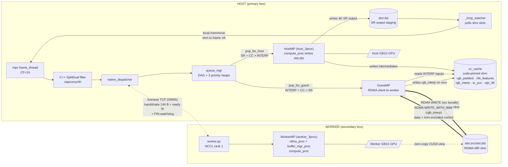
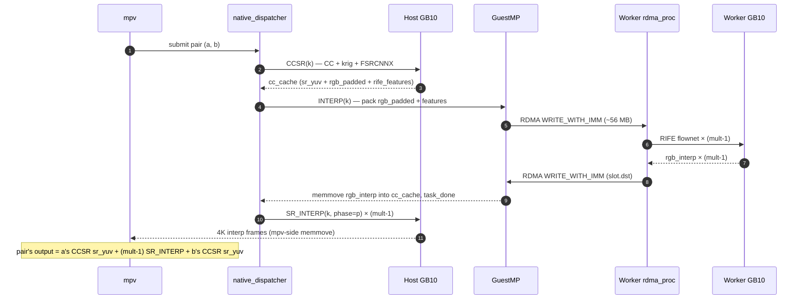

# Dual-machine RIFE + FSRCNNX pipeline

[简体中文](./README.zh-CN.md)

Split the mpv vapoursynth filter chain across two DGX Spark boxes so
each frame's RIFE interpolation + FSRCNNX super-resolution work runs
on two GB10 GPUs in parallel. Same 4K output as single-machine mode,
roughly twice the steady-state fps.

> Status: **experimental**. The single-machine path is the supported
> default; dual mode is opt-in via `install.sh install --dual-host` on
> the primary box plus `--dual-secondary` on the worker.

## What it does

For every source frame pair (a, b) the pipeline produces:

- **Real frames** (a, b): chroma-upsample → FSRCNNX luma SR → 4K
  output. Bit-identical to the single-machine output for these frames.
- **Interpolated frames** (between a and b): RIFE flownet → chroma-
  upsample → FSRCNNX luma SR → 4K output. `DUAL_INTERP_MULT=2/3/4`
  controls how many in-betweens (F9 cycles through 4 → 3 → 2 → 1).

The split is by task type, not by frame, so both GPUs stay busy on
overlapping work. See [§ Components](#components) for the breakdown.

## Requirements

- **Two DGX Spark boxes** (GB10, ARM64, Ubuntu 24.04, CUDA 13).
- **200 G RoCE link** between them — the CX7 NIC on each Spark has
  two PCIe devices that share one 200 G port; both rails must be
  reachable. Static IPs on the link (no DHCP); the install script
  prompts for self-IP + peer-IP and writes them to a config file.
- **Identical software**: same conda env, same `install.sh` build of
  mpv / vapoursynth / vsrife / fsrcnnx-cudnn. The host's `install.sh
  install --dual-host` writes the full stack; the worker's
  `install.sh install --dual-secondary` writes only what `worker.py`
  needs (no mpv main binary, no shim).

## Why dual

Steady-state at 1080p / 24 fps source → 4K / 48 fps output:

| mode | sustained fps | rough speedup |
|---|---|---|
| single | 48 – 50 | 1.00× |
| dual   | 95 – 97 | ~1.95× |

Quality matches single (real frames byte-identical; interpolated
frames carry RIFE cross-GPU non-determinism on luma, ~50–70 dB Y-PSNR
vs single, well above visible threshold).

## Design philosophy

Three principles drove every architectural choice:

1. **Keep both GPUs saturated.** The 3-queue priority dispatcher
   (CCSR / SR_INTERP / INTERP) is asymmetric on purpose — host favours
   CCSR + SR_INTERP (heavy GPU work close to mpv VA), guest favours
   INTERP (RIFE engine, throughput-bound). Each side falls back to
   the other queues when its preferred one drains, so neither GPU
   waits.

2. **Hide transit behind compute.** RDMA WRITE_WITH_IMM moves frames
   in parallel with the next task's kernel. Worker posts the next
   mid-stage SEND while the host is still running the previous CCSR
   kernel; the wire is never the critical path. NCCL handles only the
   one-time handshake (an int64[18] tensor describing dims / formats /
   variant / interp_mult); all per-frame data is RDMA.

3. **Granular tasks, auto-assigned.** CCSR / INTERP / SR_INTERP are
   small enough (~2–12 ms on GB10) that the priority scheduler can
   keep both sides loaded without per-frame coordination. The
   dispatcher decides who runs what based on current queue depth, not
   round-robin.

## Components



`cc_cache` is passive cuda-pinned shm — it stores intermediate task
results on the host side only and does no I/O itself. All copies are
initiated by `compute_proc` (kernel writes via CUDA views), `guest_mp`
(local `ctypes.memmove` from RDMA recv buffer), or `_hmp_watcher`
(mpv-side `ctypes.memmove` from `slot.dst` into mpv's frame VA).
The worker has no view of `cc_cache`: it only sees its own
`slot.src` / `slot.dst` (the RDMA-registered shm), with the bytes
arriving via WRITE_WITH_IMM.

| component | role |
|---|---|
| `native_filter/SplitDual` (C++ vapoursynth filter) | hand-off point from mpv frame_thread to Python dispatcher; submits frame pair to `compute_callable` |
| `native_dispatcher.py` | top-level orchestrator; creates HostMP + GuestMP + queue_mgr; runs the host- and guest-side dispatch loops |
| `queue_mgr.py` | DAG (CCSR → INTERP → SR_INTERP per pair) + 3 priority heaps; `pop_for_host` and `pop_for_guest` enforce host/guest preference with cross-fallback |
| `host_3proc.py` | host-side 3-process wrapper (HostMP). `dma_proc` does `process_vm_readv` from mpv into shm; `compute_proc` runs the host GPU kernels; `buffer_mgr_proc` mediates the shared state machine |
| `guest_mp.py` | host-resident RDMA client. Packs frames into pinned RDMA buffers, posts WRITE\_WITH\_IMM to the worker, drains completion queue, calls `cc_cache_writeback_fn` + `task_done_fn` |
| `worker.py` | worker entry point. Accepts the host's liveness TCP connection, reads the 144-byte handshake, spawns the 3-process pipeline. Persists across sessions; FIN/RST on the liveness socket trips the per-session watchdog and returns to accept-loop |
| `worker_3proc.py` | worker-side 3-process pipeline (WorkerMP). `rdma_proc` polls the CQ; `compute_proc` runs the worker GPU kernels; `buffer_mgr_proc` runs the slot state machine |
| `rdma_transport.py` | pyverbs wrapper. WRITE\_WITH\_IMM with the slot/stage encoded in the imm field; recv MR is the slot.dst region itself (zero-copy) |
| `cc_cache.py` | cuda-pinned shm pool shared between host's `compute_proc` and `guest_mp`. Holds intermediate `rgb_padded` / `rife_features` / `rgb_interp` / `sr_yuv` per slot; lifecycle reference-counted by queue_mgr |
| `mp_pipeline.py` | shared framework for `MPPipelineBase` (HostMP / WorkerMP) + `SlotRingShm` + eventfd channels |

## Task split

Each source pair `k` is split into three task types and DAG-ordered:

```
CCSR(k)  ──▶  INTERP(k)  ──▶  SR_INTERP(k, phase=1..mult-1)
   │
   └─▶  (CCSR feeds rgb_padded + rife_features into cc_cache; INTERP reads
        them, runs flownet(s), writes mult-1 rgb_interp frames; each
        SR_INTERP reads one rgb_interp and runs FSRCNNX)
```

Default queue priorities:

- **Host** prefers `SR_INTERP → CCSR → INTERP`. The host GPU is closest
  to mpv VA (writeback is local memcpy), and SR_INTERP / CCSR finish
  with a 4K output destined for mpv, so doing them on the host saves
  the wire round-trip.
- **Guest** prefers `INTERP → CCSR → SR_INTERP`. RIFE is throughput-
  bound and the dominant per-task cost; running it on the guest GPU
  while the host runs SR keeps both saturated.

Both sides fall back to the other priorities when their preferred
queue drains — no static partitioning.

## Dataflow per frame pair



## Default interp_mult per source

`F9` cycles `DUAL_INTERP_MULT` at runtime. The default the chain
picks on file-load is resolution + framerate dependent — the
per-frame budget at 4K output is the constraint.

| source resolution | source fps | default `DUAL_INTERP_MULT` | output rate |
|---|---|---|---|
| ≤ 720p          | ≤ 25 fps        | **4** | up to 100 fps |
| ≤ 720p          | 26 – 30 fps     | **3** | 78 – 90 fps   |
| 1080p, 4K       | ≤ 25 fps        | **3** | up to 75 fps  |
| 1080p, 4K       | 26 – 30 fps     | **2** | 52 – 60 fps   |
| any             | > 30 fps        | **1** (interp off) | source rate |

`mult=1` keeps both GPUs busy on CCSR + SR (no RIFE), reducing the
chain to a pure 4K SR pipeline. `mult=4` only fits the 4K output
budget at ≤ 720p source because the heavier resolutions saturate the
GPU on the SR_INTERP step alone.

These thresholds are picked so the worker's slowest task type (INTERP
at full multiplier × source-size frame) just fits the inter-frame
budget at the output rate. Push higher (e.g. mult=4 at 1080p / 30 fps
= 120 fps target) and the chain still runs, but dispatcher fps drops
below the output rate and mpv stutters.

## Tech selection rationale

| choice | alternative | why |
|---|---|---|
| **RDMA WRITE_WITH_IMM** for per-frame data | NCCL collectives | NCCL on Grace can't use GPUDirect (peermem won't load, dmabuf export fails) — has a ~14 ms transit floor. Pyverbs WRITE_WITH_IMM bypasses NCCL entirely; effective transit ~0 ms when fully pipelined behind compute |
| **All control over a single TCP socket** | NCCL + TCP split | the entire control plane (handshake bytes, ready signal, FIN-watchdog) goes over one liveness TCP socket on port 29905. NCCL is gone — it only ever carried a 144-byte handshake, and its per-collective deadline (3 s) made cold TRT compile on the worker impossible to wait for. One socket + `struct.pack` removes ~80 lines of glue, kills the `TORCH_NCCL_*` env zoo, and drops the TCPStore port (29500) |
| **3-process worker** | single process | separates RDMA poll (latency-sensitive, busy-loop on CQ), GPU compute (latency-tolerant, batched), and slot state machine (CPU-bound bookkeeping). Each can be pinned to a different core; GIL contention disappears |
| **`process_vm_readv` host → shm** | DMA from mpv VA | mpv frames live in mpv's heap, not a shared mapping; readv crosses the address-space boundary in one syscall. Throughput ~30 GB/s on Grace — enough for 4K 4:2:0 at 100+ fps |
| **mpv-side `memmove` for writeback** | `process_vm_writev` from dma_proc | shm is mapped in both mpv and dma_proc, so mpv can memcpy locally at ~30 GB/s; cross-process writev is ~2.5 GB/s (page-fault overhead). Saves ~8 ms per SR task at 4K |
| **3-queue priority dispatch** | unified single heap | symmetric heap would have host and guest contending on every pop; per-side queues with cross-fallback keep the lock contention low while still letting either side drain idle work |
| **cc_cache cuda-pinned shm** | cudaMemcpy per task | host's compute_proc and guest_mp's send packer both need the same `rgb_padded` bytes; a single pinned region is mapped into both at zero cost. Avoids HtoD/DtoH bounce |
| **Asymmetric host/guest priorities** | symmetric | host's GPU writes directly to mpv VA (no wire); guest's writes go over RDMA. Preferring SR_INTERP/CCSR on host keeps the wire idle for INTERP, which is heavier anyway. Symmetric scheduling tested ~1.5 fps slower |
| **`DUAL_INTERP_MULT` toggle (1–4)** | fixed mult=2 | F9 cycles 4 → 3 → 2 → 1 at runtime. mult=1 is "SR-only dual" (CCSR on both sides, no interp). Per-file auto-default driven by (source resolution, source fps) — see the table above; ffprobe + lua hook write `/tmp/dual_machine_mult_override` before rife.vpy reads it |
| **Dispatcher singleton across vf-rebuild** | re-init host_mp + reload TRT per seek | mpv tears down and rebuilds the vapoursynth filter on every seek. Caching the host_mp / queue_mgr / guest_mp / compute closure in a module-level dict in `_dispatcher_singleton.py` survives the rebuild — no respawn of 3 host children, no TRT engine reload, no RDMA QP re-handshake. Drops the seek recovery from ~8 s to ~3 s |
| **lua side-channel for seek / shutdown events** | mpv vapoursynth API surfacing them to the filter | mpv's vf API doesn't expose seek or exit events to the filter, so the dispatcher can't see them from inside python. `scripts/dual_seek_flush.lua` writes `/tmp/dual_machine_seek_epoch` on `seeking` property going true (fires before vf teardown, so parked compute() threads unpark in time) and `/tmp/dual_machine_shutdown` on the `shutdown` event (mpv's embedded python doesn't fire atexit, so this is the only reliable close hook) |
| **inotify-driven seek-flush watcher** | 100 ms poll loop | the watcher blocks on `inotify_init1` + `os.read` (ctypes, no extra dep). lua's file write wakes it in microseconds vs the polling path's ~50 ms average — felt as instant on a progress-bar drag instead of a noticeable freeze |
| **wait_phase_done returns silently on timeout** | raises RuntimeError | a python exception out of `compute_callable` becomes a vapoursynth filter error, which mpv treats as fatal and exits the process. Return silently (and let mpv display whatever was in the dst VA — usually black, replaced within a couple of vsyncs by the next frame) so a worker stall or trailing-K corner case never crashes playback |

## `VK_LAYER_PRIORITY_BOOST`

Vulkan instance layer that elevates mpv's present queue to
`VK_QUEUE_GLOBAL_PRIORITY_HIGH_KHR`, so the GPU scheduler favours
vsync presentation over the host-side CUDA work (RIFE post-flownet +
FSRCNNX + krig + CCSR) on the shared GB10. ~+10% display fps on
1080p24×mult=3 to a 60 Hz panel; default-on after `install.sh
--dual-host`.

Wired up by `install.sh`:
- builds + installs the layer to `/usr/local/lib/` and
  `/usr/share/vulkan/implicit_layer.d/` (one-time sudo); the Vulkan
  loader ignores user-local paths under `AT_SECURE=1`, so a system
  path is required;
- `setcap cap_sys_nice+ep` on the mpv binary (HIGH/REALTIME require
  the cap);
- `mpv-conda` + `jellyfin-mpv-shim` wrappers export
  `VK_PRIORITY_BOOST_LEVEL=high`;
- `uninstall` reverses all three.

`native_dispatcher` calls `_mpv_relax_for_dual_under_caps()` at module
load (drop file caps + `PR_SET_DUMPABLE=1` + `PR_SET_PTRACER_ANY`) so
the cap-bearing mpv still lets the `host_3proc` dma_proc child use
`process_vm_readv` on it. No-op on no-cap installs.

Override the level per launch with `VK_PRIORITY_BOOST_LEVEL` (`low` /
`medium` / `high` / `realtime`); kill globally with
`VK_PRIORITY_BOOST_DISABLE=1`. Source + build in
[`vk_priority_layer/`](./vk_priority_layer/).

## Server-mode worker

The worker process persists across host sessions. The host's
`native_dispatcher.cleanup()` closes the liveness TCP socket;
the worker's watchdog thread sees the EOF (or keepalive RST on host
crash) and tears down the current session's pipeline, then loops back
to `listener.accept_session()` waiting for the next host. A new
host playback session reattaches without a daemon restart — typically
under 3 s end-to-end. There is no NCCL group to re-init; the entire
control plane is a single TCP socket.

## See also

- [`bench/README.md`](../bench/README.md) — color / fps / timing benches.
- [`../docs/`](../docs/) — measured performance + color accuracy tables.
- [`native_filter/README.md`](./native_filter/README.md) — C++ vapoursynth
  filter that hands frames to `native_dispatcher`.
