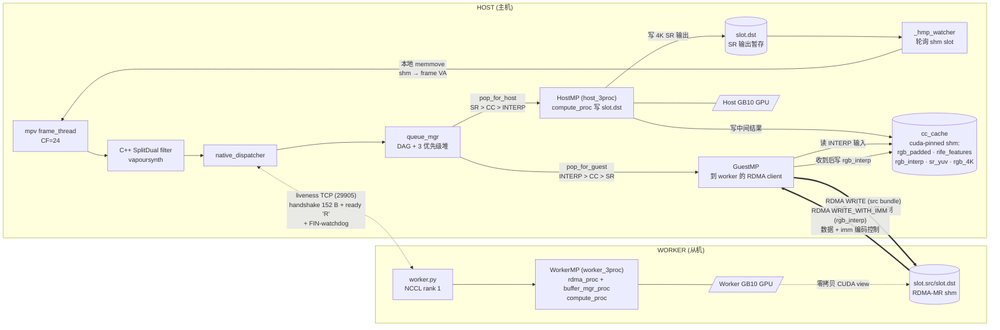
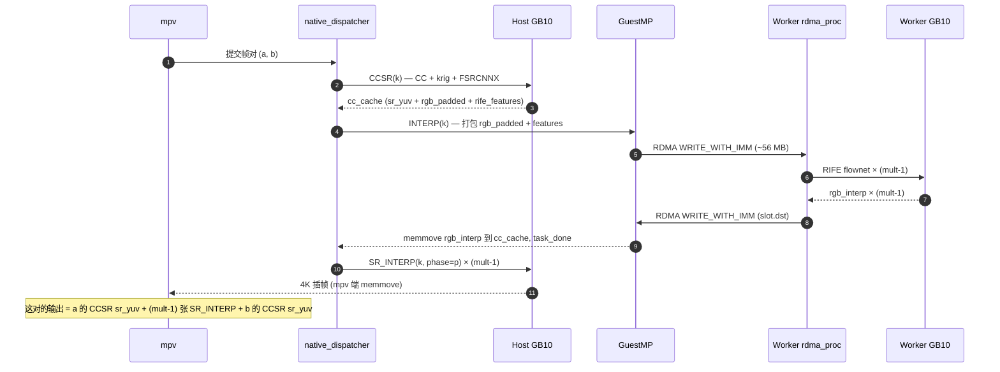

# 双机 RIFE + FSRCNNX 管线

[English](./README.md)

把 mpv 的 vapoursynth filter chain 切到两台 DGX Spark 上，让每帧的
RIFE 插帧 + FSRCNNX luma 超分在两块 GB10 上并行跑。输出和单机模式一致
都是 4K，稳态 fps 大约翻倍。

> 状态：**experimental**。 单机路径是默认支持版本；双机要在主机用
> `install.sh install --dual-host` 装，从机用 `--dual-secondary` 装。

## 它做什么

对每对源帧 （a, b） 输出：

- **真实帧** (a, b): chroma 升采样 → FSRCNNX luma 超分 → 4K 输出。
  这部分和单机输出 byte-identical.
- **插帧** （a 和 b 之间）： RIFE flownet → chroma 升采样 → FSRCNNX
  luma 超分 → 4K 输出。 `DUAL_INTERP_MULT=2/3/4` 控制几张中间帧
  （F9 在 4 → 3 → 2 → 1 之间循环）。

切分按 task 类型，不按帧；两块 GPU 都在不同任务上并行工作。组件细节看
[§ 组件](#组件)。

## 需要什么

- **两台 DGX Spark** (GB10, ARM64, Ubuntu 24.04, CUDA 13).
- **RoCE 链路** 互联。 CX7 要跑满 200 Gb/s 必须同时驱动两条 PCIe 路径，
  所以 fabric 在不同路径上各配一条 rail（`enp1s0f0np0` 与
  `enP2p1s0f1np1`，各自一个 /24），**不是 bond**。 本管线只用其中一条，
  所以实际跑 ~98 Gb/s，原因见
  [为什么链路只跑 ~98 Gb/s 而不是 200](#为什么链路只跑-98-gbs-而不是-200)。
  链路上用静态 IP （不要 DHCP）；安装脚本会提示输入自身 IP 和对端 IP，
  写入配置文件。
- **软件一致**：一样的 conda env， 一样 `install.sh` 装出来的
  mpv / vapoursynth / vsrife / fsrcnnx-cudnn。 主机跑
  `install.sh install --dual-host` 装完整栈；从机跑
  `install.sh install --dual-secondary` 只装 `worker.py` 必须的部分
  （没有 mpv 主程序，没有 shim）。

## 双机有什么好处

1080p / 24 fps 源 → 4K / 48 fps 输出，dispatcher 稳态 fps
（完整表见 [`bench/results.md`](../bench/results.md)）：

| mode | dispatcher fps（稳态） |
|---|---|
| 双机 mult=2 | 95 – 96 |
| 双机 mult=3 | 87 |
| 双机 仅 RIFE（无 SR） | 153 – 156 |
| 双机 仅 SR（mult=1） | 145 – 147 |

约为单机稳态的 2 倍。画面质量和单机一致 （真实帧 byte-identical；
插帧因为 RIFE 跨 GPU 非确定性，luma 大约 50–70 dB Y-PSNR vs 单机，
远高于可见阈值）.

## 设计理念

三条原则贯穿所有架构选择：

1. **两块 GPU 都跑满。** 3-queue 优先级调度器 （CCSR / SR_INTERP /
   INTERP） 是有意设计成不对称的 — host 偏好 CCSR + SR_INTERP （离
   mpv VA 近的重 GPU 任务）, guest 偏好 INTERP （RIFE 引擎，吞吐
   受限）。 各自偏好的 queue 空了会 fallback 到对方的 queue，所以
   两块 GPU 都不会等。

2. **通信藏在计算后面，而且只传活字节。** RDMA WRITE_WITH_IMM 跟
   下一个 task 的 kernel 并行搬数据；网线永远不在关键路径。 每个
   task 只收发它的类型真正用到的字节区间 （INTERP mult=2 回传
   12.4 MB 而不是整槽 54 MB；CCSR/SR_INTERP 请求约 12.5 MB 而不是
   58.5 MB），并且 INTERP / SR_INTERP 请求负载走零拷贝：cc_cache
   区域注册成 MR，NIC 按 SGE 列表直接 gather，派发线程不经过
   ~5 GB/s cudaHostRegister 慢读路径做任何 memmove。 一次性
   handshake （int64[19]，描述尺寸 / 格式 / variant / interp_mult /
   encode 通道数） 走 liveness TCP socket；每帧数据全走 RDMA.

3. **任务细分，自动分配。** CCSR / INTERP / SR_INTERP 都够小 （GB10
   上大约 2–12 ms），优先调度器能让两边同时有活，不需要逐帧协调。
   dispatcher 根据当前 queue 深度决定谁跑什么，不是 round-robin.

## 组件



`cc_cache` 是被动 cuda-pinned shm —— 它只在 host 端存中间任务结果，
自己不发起任何 I/O。 所有 copy 都由 `compute_proc` （kernel 通过 CUDA
view 写） / `guest_mp` （从 RDMA recv buffer 本地 `ctypes.memmove`） /
`_hmp_watcher` (mpv 端 `ctypes.memmove` 从 `slot.dst` 到 mpv frame
VA) 发起。 worker 看不到 cc_cache： 它只看到自己的
`slot.src` / `slot.dst` （RDMA 注册的 shm）， 字节通过 WRITE_WITH_IMM
到达。

| 组件 | 作用 |
|---|---|
| `native_filter/SplitDual` (C++ vapoursynth filter) | 把 mpv frame_thread 的帧交给 Python dispatcher；给 `compute_callable` 提交帧对 |
| `native_dispatcher.py` | 顶层 orchestrator；创建 HostMP + GuestMP + queue_mgr；跑 host 和 guest 的 dispatch loop |
| `queue_mgr.py` | DAG （每对 CCSR → INTERP → SR_INTERP） + 3 个优先级堆；`pop_for_host` 和 `pop_for_guest` 各自有偏好 + 跨队 fallback |
| `host_3proc.py` | host 端 3 进程封装 （HostMP）. `dma_proc` 做 `process_vm_readv` 从 mpv 拉到 shm;`compute_proc` 跑 host GPU kernel;`buffer_mgr_proc` 中转共享状态机 |
| `guest_mp.py` | host 进程内的 RDMA client。 把帧打包进 pinned RDMA buffer,post WRITE\_WITH\_IMM 给 worker,drain CQ，回调 `cc_cache_writeback_fn` + `task_done_fn` |
| `worker.py` | worker 入口。 accept host 的 liveness TCP 连接，读 152 字节 handshake，启 3 进程 pipeline。 跨 session 持续；liveness socket 上的 FIN/RST 触发 per-session watchdog 后回 accept-loop |
| `worker_3proc.py` | worker 端 3 进程 pipeline (WorkerMP). `rdma_proc` 轮询 CQ;`compute_proc` 跑 worker GPU kernel;`buffer_mgr_proc` 跑 slot 状态机 |
| `rdma_transport.py` | pyverbs 包装。 WRITE\_WITH\_IMM 把 slot/stage 编码进 imm field;recv MR 就是 slot.dst 区域 （零拷贝） |
| `cc_cache.py` | host 的 `compute_proc` 和 `guest_mp` 共享的 cuda-pinned shm 池。 每 slot 存中间结果 `rgb_padded` / `rife_features` / `rgb_interp` / `sr_yuv`；生命周期由 queue_mgr 引用计数 |
| `mp_pipeline.py` | `MPPipelineBase` (HostMP / WorkerMP) + `SlotRingShm` + eventfd channel 的共享框架 |

## 任务切分

每对源帧 `k` 拆成三种 task,DAG 排好序：

```
CCSR(k)  ──▶  INTERP(k)  ──▶  SR_INTERP(k, phase=1..mult-1)
   │
   └─▶  (CCSR 把 rgb_padded + rife_features 写进 cc_cache;INTERP 读,
        跑 flownet,写 mult-1 张 rgb_interp;每个 SR_INTERP 读一张
        rgb_interp 跑 FSRCNNX)
```

默认队列优先级：

- **Host** 偏好 `SR_INTERP → CCSR → INTERP`。 host GPU 离 mpv VA 最近
  （writeback 是本地 memcpy），SR_INTERP / CCSR 完成的是要给 mpv 的 4K
  输出，host 上做省一次往返。
- **Guest** 偏好 `INTERP → CCSR → SR_INTERP`。 RIFE 吞吐受限，是单
  task 最重的；guest GPU 跑 RIFE 时 host GPU 跑 SR，两边都饱和。

各自偏好的 queue 空了会 fallback 到对方优先级 — 不是静态分区。

## 单帧对的数据流



## 不同分辨率/帧率的默认 interp_mult

`F9` 运行时切换 `DUAL_INTERP_MULT`。文件加载时挑哪个默认值看源分辨率
和帧率 — 4K 输出的单帧预算是约束。

| 源分辨率 | 源帧率 | 默认 `DUAL_INTERP_MULT` | 输出帧率 |
|---|---|---|---|
| ≤ 720p          | ≤ 25 fps         | **4** | 最高 100 fps |
| ≤ 720p          | 26 – 30 fps      | **3** | 78 – 90 fps  |
| 1080p, 4K       | ≤ 25 fps         | **3** | 最高 75 fps  |
| 1080p, 4K       | 26 – 30 fps      | **2** | 52 – 60 fps  |
| 任意            | > 30 fps         | **1** （不插帧） | 源帧率 |

`mult=1` 让两块 GPU 都跑 CCSR + SR （不跑 RIFE），链路退化成纯 4K
SR 管线。 `mult=4` 只能在 ≤ 720p 源上跑得动，因为更高分辨率单是 SR_INTERP
这步就把 GPU 占满了。

阈值的选法是让 worker 最慢的 task type （最大倍数 × 源尺寸的 INTERP）
正好够输出帧率的预算。 推得更高 （比如 1080p / 30 fps 用 mult=4 = 输出
120 fps） 链路还是能跑，但 dispatcher fps 掉到输出帧率之下，mpv 会卡。

## 技术选型理由

| 选择 | 备选 | 为什么 |
|---|---|---|
| **RDMA WRITE_WITH_IMM** 传每帧数据 | NCCL collective | Grace 上 NCCL 用不了 GPUDirect （peermem 不能装，dmabuf export 失败） — 有 ~14 ms transit 下限。 Pyverbs WRITE_WITH_IMM 完全绕开 NCCL；完全 pipeline 在 compute 后面时 effective transit ~0 ms |
| **控制面全走一条 TCP socket** | NCCL + TCP 分担 | 整个控制面 （handshake 字节 / ready 信号 / FIN-watchdog） 都跑在 29905 liveness TCP socket 上。 NCCL 整个去掉了 — 它就负责发个小 handshake，带的 per-collective deadline （3 s） 又让 worker 冷启 TRT 编译完全没法等。 一根 socket + `struct.pack` 砍掉约 80 行胶水代码，顺便清空 `TORCH_NCCL_*` env 一堆，还把 TCPStore 端口 （29500） 也丢了 |
| **Worker 3 进程** | 单进程 | 把 RDMA 轮询 （延迟敏感，CQ busy-loop） / GPU 计算 （容忍延迟，可批量） / slot 状态机 （CPU bookkeeping） 分开。 各自钉一个核；GIL 竞争没了 |
| **`process_vm_readv` host → shm** | mpv VA DMA | mpv 帧住在 mpv 堆里，不是共享映射；readv 一次 syscall 跨地址空间。 Grace 上吞吐 ~30 GB/s — 够 4K 4:2:0 跑 100+ fps |
| **mpv 端 `memmove` writeback** | dma_proc 的 `process_vm_writev` | shm 在 mpv 和 dma_proc 都有映射，mpv 本地 memcpy ~30 GB/s；跨进程 writev ~2.5 GB/s （page fault 开销）。 4K SR task 省 ~8 ms |
| **3-queue 优先级调度** | 单一堆 | 对称堆 host 和 guest 每次 pop 都要争锁；按 side 分队 + 跨队 fallback 锁竞争低，但 idle 任务还是能被另一边消化 |
| **cc_cache cuda-pinned shm** | 每个 task 一次 cudaMemcpy | host 的 compute_proc 和 guest_mp 的 send packer 都要同一份 `rgb_padded`；单个 pinned 区域两边零成本映射。 省 HtoD/DtoH |
| **不对称 host/guest 优先级** | 对称 | host 的 GPU 直接写 mpv VA （不走网）；guest 的写要走 RDMA. host 上偏 SR_INTERP/CCSR 让网线空给更重的 INTERP。 对称调度测过慢 ~1.5 fps |
| **`DUAL_INTERP_MULT` 开关 （1–4）** | 固定 mult=2 | F9 运行时在 4 → 3 → 2 → 1 之间循环。 mult=1 = "只 SR 双机" （CCSR 两边跑，无插帧）。 每文件 auto-default 看 （源分辨率， 源帧率） — 见上面那张表；ffprobe + lua hook 在 rife.vpy 读之前把值写进 `/tmp/dual_machine_mult_override` |
| **dispatcher 跨 vf-rebuild 单例** | 每次 seek 重 init host_mp + 重 load TRT | mpv 每次 seek 会拆掉再重建 vapoursynth filter。 把 host_mp / queue_mgr / guest_mp / compute closure 缓存在 `_dispatcher_singleton.py` 的 module-level dict 里，能跨 rebuild 存活 — 不重 spawn 3 个 host 子进程、不重 load TRT 引擎、不重做 RDMA QP handshake. seek 恢复从 ~8 s 砍到 ~3 s |
| **lua side-channel 传 seek / shutdown 事件** | mpv vapoursynth API 把事件传给 filter | mpv 的 vf API 不把 seek 或退出事件交给 filter,python 里看不到。 `scripts/dual_seek_flush.lua` 在 `seeking` property 变 true 时 （vf 拆除之前 fire，正好赶在 compute() 线程开始等之前） 写 `/tmp/dual_machine_seek_epoch`，在 `shutdown` 事件时写 `/tmp/dual_machine_shutdown` （mpv 嵌入式 python 的 atexit 不 fire，这是唯一靠谱的关闭钩子） |
| **inotify 驱动的 seek-flush watcher** | 100 ms 轮询 | watcher 用 `inotify_init1` + `os.read` 阻塞 （ctypes，不加依赖）。 lua 写文件，kernel μs 级唤醒 vs 轮询路径平均 ~50 ms — 拖动进度条手感是"即时"而不是"明显卡一下" |
| **wait_phase_done 超时静默返回** | 抛 RuntimeError | python exception 从 `compute_callable` 抛出来会被 pybind11 / vapoursynth 当成 filter error,mpv 会当致命错误退出整个进程。 直接静默返回 （让 mpv 显示 dst VA 里原本的内容 —— 通常是黑色，几个 vsync 后被下一帧覆盖） — worker 卡死或尾帧 corner case 永远不会让播放崩溃 |

## 为什么链路只跑 ~98 Gb/s 而不是 200

fabric 给每个节点的确是 200 Gb/s，本管线只用了一半 —— 这是传输层的性质，
既不是配置没配对，也不是线插少了。

### CX7 到底长什么样

一台 DGX Spark 上只有**一颗** ConnectX-7 ASIC —— 四个 PCI function 报告
的 `phys_switch_id` 完全相同 —— 带两个物理口。它通过**两条 PCIe5 x4 root
complex** 接到主机，而且**每个物理口在两条路径上各暴露一次**（socket
direct）。所以四个 netdev 是 2 个口 × 2 条 PCIe 路径，不是四个口：

| netdev | PCI function | `devlink` port | PCIe 路径 |
|---|---|---|---|
| `enp1s0f0np0` | `0000:01:00.0` | port 0 | A |
| `enP2p1s0f0np0` | `0002:01:00.0` | port 0 | B |
| `enp1s0f1np1` | `0000:01:00.1` | port 1 | A |
| `enP2p1s0f1np1` | `0002:01:00.1` | port 1 | B |

天花板由两件事决定：

- **每个物理口本身就是 200G 能力**。`ethtool` 通告
  `200000baseCR4/Full` 和 `200000baseCR2/Full`。这里协商成 100 Gb/s 只是
  因为 DAC 和交换机口是 QSFP28 100G（`ethtool -m` 显示
  `Identifier: QSFP28`、`100G Base-CR4`）。
- **每条 PCIe 路径是 x4 @ 32 GT/s**（`LnkSta: Speed 32GT/s, Width x4`），
  约 128 Gb/s 原始带宽，单条扛不动 200G。网卡接到两条 root complex 上，
  唯一原因就是这个。

所以 **200 Gb/s 永远意味着并行驱动两条 PCIe 路径**，也就是两个 rdma
device。插几根线是另一回事 —— 下面两种都能到 200 Gb/s：

- 一根 200G 线插 port 0，用 `enp1s0f0np0`（路径 A）+ `enP2p1s0f0np0`
  （路径 B）；
- 两根 100G 线，每个口用一个 netdev，但要落在**不同**路径上。

永远做不到的是：单个 netdev、单条 PCIe 路径、或单个 QP 跑到 200 Gb/s。

本 fabric 用的是两根线那种形式，因为交换机口和 DAC 都是 100G。它配置
`enp1s0f0np0`（port 0，路径 A）和 `enP2p1s0f1np1`（port 1，路径 B），另外
两个不配 IP —— 它们所在物理口的那根线，已经被占着该口的那条路径吃满了。
如果改成 `enp1s0f0np0` + `enp1s0f1np1`，两条 rail 就都压在路径 A 上，整机
被卡在 100 Gb/s 附近。

做 bond 也改变不了这一点。mlx5 硬件 RoCE LAG 只能在**同一个 PCI device**
的 PF 之间形成 —— 那是同一条 PCIe 路径后面的两个 netdev，不会增加 PCIe
带宽；而且 RoCE LAG 按 QP 哈希，单个 QP 无论如何只落在一个口上。跨两条
root complex 做 bond 则只得到普通 Linux bond，没有 bonded RDMA device，
RoCE 会退回单口。

### 传输层怎么用这两条 rail

`guest_mp.py`（host）和 `worker_3proc.py`（worker）为每条 rail 各开一个
`RDMAContext` 和一对 RC QP，并把每次传输拆到所有 rail 上。

rail 列表来自 `DUAL_RDMA_DEVS` / `DUAL_RDMA_GIDS`（host）与
`WMP_RDMA_DEVS` / `WMP_RDMA_GIDS`（worker），逗号分隔，由 `install.sh`
在配置时枚举写入。第 *r* 条 rail 的 TCP 握手端口是
`DUAL_RDMA_PORT + r`，所以双 rail 安装会用 29900 和 29901。不设置（或只
填一个）即退回单 rail 传输，与多 rail 出现之前完全一致 —— 这也是某条
rail 出问题时的兜底。

两个方向的拆分方式不同，因为用的 verb 不同：

- **worker → host** 是 `RDMA WRITE_WITH_IMM`。发送方自己指定远端地址，
  所以区间可以任意切，碎片在目的端自动拼回。`imm` 里带
  `(slot, stage, part, n_parts)`；host 要数满该 `(slot, stage)` 的
  `n_parts` 个到达后才执行写回。小于 1 MB 的写整块走一条 rail，并轮转，
  这样一串小写也能分散开。
- **host → worker** 是 `SEND`/`RECV`。报文落在该 QP 上下一个预投递的
  recv WR 起始处，所以切点必须事先固定（`src_partition`），而且各 rail
  的 recv 队列必须**锁步**。因此每条报文都会在每条 rail 上各投一个分片
  —— 该 rail 窗口内没有字节时投零长度 —— 并且 host 用 `io_lock` 保证各
  rail 上的报文顺序一致。短报文若跳过某条 rail，那条队列就会错位，之后
  所有报文都会落进错误 slot 的缓冲区。

MR 属于单个 PD，所以每个 staging buffer、`cc_cache` 区域以及 worker 的
slot ring 都要按 rail 各注册一份（`MultiRailBuffer`）。dispatcher 仍然用
rail 0 的 lkey 构造 SGE，由 `notify_submit` 按 rail 重映射。

链路容量，两节点间 `ib_write_bw`（2026-09-19，`-q 8 -s 65536 -D 15`）：

| | Gb/s |
|---|---|
| 仅 rail 0（`rocep1s0f0`） | 98.01 |
| 仅 rail 1（`roceP2p1s0f1`） | 98.01 |
| 两条并行 | 196.02 |

在条带化 `SEND` 路径上用管线真实的报文尺寸实测（CCSR 6.2 MB、
SR_INTERP 12.4 MB、INTERP 58.5 MB，4 个 slot，60 条报文，2026-09-19）：
**156 Gb/s**，对比单 rail 的 98。没到 196 是因为比 rail 0 窗口短的报文会
整块落在 rail 0 上 —— 窗口必须固定，这是 SEND/RECV 的要求。只有 INTERP
会横跨两条 rail，而 INTERP 占这个方向约 92% 的字节，所以这点不均衡代价
很小。`WRITE_WITH_IMM` 方向没有这个约束，每个区间都是均分的。


## `VK_LAYER_PRIORITY_BOOST`

Vulkan instance layer，把 mpv 的 present queue 升到
`VK_QUEUE_GLOBAL_PRIORITY_HIGH_KHR`，让 GPU 调度器更倾向把 vsync 抓住，
而不是被 host 侧 CUDA 任务 （RIFE 后段、 FSRCNNX、 krig、 CCSR） 抢光。
1080p24×mult=3 投 60 Hz 面板 +~10% display fps；`install.sh --dual-host`
之后默认开启。

`install.sh` 自动接好：
- 把 layer 安装到 `/usr/local/lib/` + `/usr/share/vulkan/implicit_layer.d/`
  （一次性 sudo）；用户本地路径在 `AT_SECURE=1` 下被 Vulkan loader 忽略，
  所以必须放系统路径；
- 给 mpv 二进制 `setcap cap_sys_nice+ep` （HIGH/REALTIME 需要这个 cap）；
- `mpv-conda` 和 `jellyfin-mpv-shim` wrapper 都 export
  `VK_PRIORITY_BOOST_LEVEL=high`；
- `uninstall` 把上面三步都撤掉。

`native_dispatcher` 在 module 加载时调 `_mpv_relax_for_dual_under_caps()`
（drop file caps + `PR_SET_DUMPABLE=1` + `PR_SET_PTRACER_ANY`），让带
cap 的 mpv 仍允许 `host_3proc` 的 dma_proc 用 `process_vm_readv` 读自己。
没有 cap 的安装下三个调用都是 no-op。

单次启动想换档：`VK_PRIORITY_BOOST_LEVEL` 取
`low` / `medium` / `high` / `realtime`； 一键关：`VK_PRIORITY_BOOST_DISABLE=1`。
源码 + build 脚本在 [`vk_priority_layer/`](./vk_priority_layer/)。

## Server-mode worker

worker 进程跨 session 持续。 host 的 `native_dispatcher.cleanup()`
关一个专用 TCP liveness socket;worker 的 watchdog 线程看到 EOF （或
host crash 时的 keepalive RST），拆掉当前 session 的 pipeline，然后
回到 `listener.accept_session()` 等下一个 host。 新的 host 播放
session 不用重启 daemon 就能 reattach — 一般 3 s 内。 没有 NCCL group 要
re-init，整个控制面就一个 TCP socket。

watchdog 是对称的：**host** 侧同样在这条 socket 上常驻一个线程。
worker 会话中死亡 （crash / 断电 / 断链） 时 host ~3 s 内感知，把
在途 guest 任务标记失败 （而不是每对 pair 各等 1 秒黑帧超时），已
认领的任务回流给 host dispatcher，播放无缝降级单机继续。 Shift+F9
一键重试 dual，和连接失败时一样。

长会话里 seek 很便宜：seek-flush 清扫会释放消费者已被 flush 掉的
cc_cache 槽位，反复拖进度条也不会耗尽 32 槽的池子。

## 另见

- [`bench/README.md`](../bench/README.zh-CN.md) — color / fps / timing bench.
- [`../docs/`](../docs/) — 实测性能 + 颜色准度数据表。
- [`native_filter/README.md`](./native_filter/README.md) — 把帧交给
  `native_dispatcher` 的 C++ vapoursynth filter.
